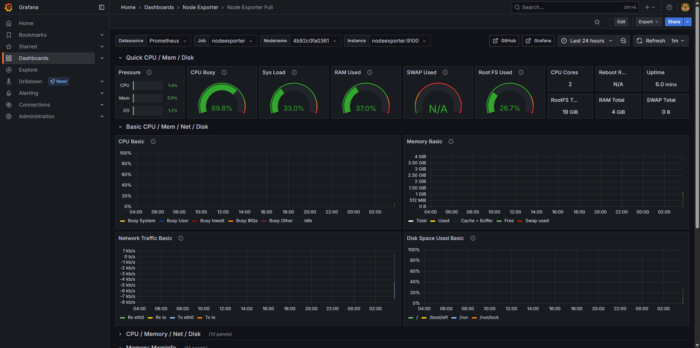
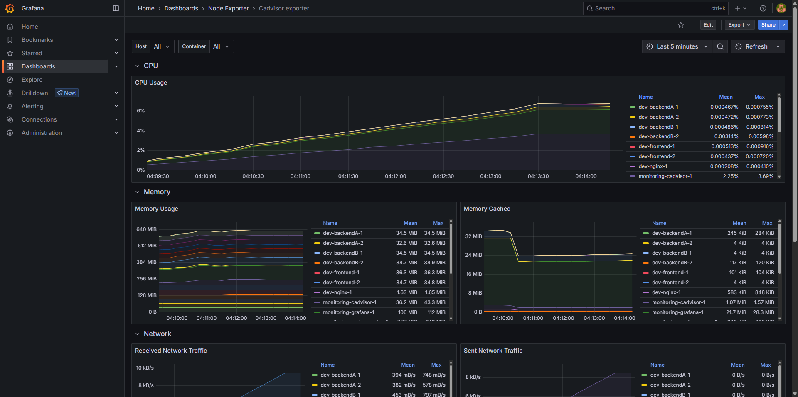
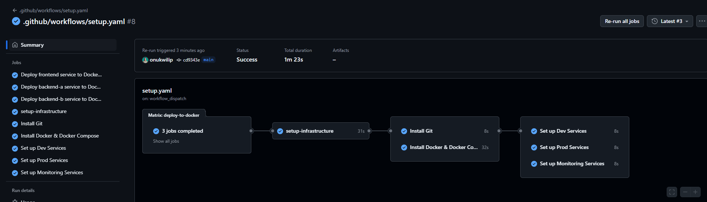
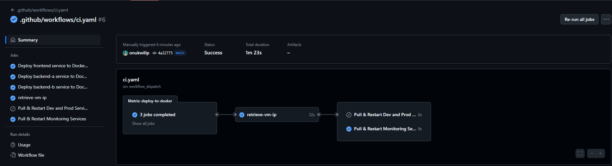

# 🚀 Automated Microservices Deployment on Google Cloud VM


This project demonstrates a fully automated GitOps-style deployment of three containerized microservices into both development and production environments on a Google Cloud Compute Engine VM — complete with monitoring, infrastructure provisioning, and CI/CD pipelines using Terraform, Docker, and GitHub Actions.

## 🌐 Overview

This setup deploys:

- A **frontend service**
- Two backend services: `backend-a` and `backend-b`

Each service is containerized and automatically built, pushed to the Docker registry, and deployed onto a VM with Docker Compose — no manual steps required.

## ✅ What’s Automated?

### 🛠 Infrastructure Provisioning with Terraform

- A **VM instance** is provisioned on **Google Cloud Compute Engine**
- **Firewall rules** are configured to expose essential ports like 80, 3000, 3001, 8080, 9100, etc.
- **SSH keys** and metadata are automatically injected

### 📦 Application Deployment with Docker Compose

- Dev and prod environments are set up using **Docker Compose**
- Each environment hosts 3 services (frontend, backend-a, backend-b)
- NGINX is configured as a reverse proxy for internal service routing


### 📈 Monitoring with Grafana + Prometheus

- Prometheus scrapes metrics from:

  - Node Exporter (for host-level VM metrics)
  - cAdvisor (for container metrics)

- Grafana dashboards provide real-time insights
- Monitoring helps determine when to **scale services**




### 🔁 CI/CD with GitHub Actions

- Fully automated pipeline:

  1. Builds Docker images for all services
  2. Pushes to Docker Hub (GHCR)
  3. Provisions infrastructure using Terraform
  4. Installs Git & Docker on the VM
  5. Deploys services to dev and prod using Docker Compose
  6. Sets up monitoring dashboards




## 🗂 Folder Structure

```
📁 .github/workflows/
├── ci.yaml          # CI workflow for building and pushing Docker images
└── setup.yaml       # CD pipeline for provisioning VM and deploying services

📁 backend-a/
📁 backend-b/
📁 frontend/
├── src/             # TypeScript source files
├── dist/            # Compiled JavaScript output
├── Dockerfile       # Docker build setup for each service

📁 dev/
├── docker-compose.yaml  # Docker Compose config for dev environment
└── nginx.conf            # NGINX config for routing between services

📁 prod/
├── docker-compose.yaml  # Docker Compose config for production
└── nginx.conf            # NGINX config for prod routing

📁 monitoring/
├── docker-compose.yaml        # Monitoring stack setup
├── prometheus.yaml            # Prometheus scrape config
├── datasources/               # Grafana datasource provisioning
├── dashboards/                # Grafana dashboards (JSON)
└── dashboards-config/         # Grafana dashboard provisioning config

📁 terraform/
├── main.tf              # Infrastructure definition
└── variables.tf         # Terraform input variables

.gitignore
```

## 🧠 Technologies Used

- **Google Cloud Compute Engine**
- **Terraform** for infrastructure as code
- **Docker & Docker Compose**
- **Prometheus**, **Grafana**, **Node Exporter**, **cAdvisor**
- **GitHub Actions** for GitOps-style CI/CD
- **NGINX** as internal load balancer

## ⚙️ Setup Instructions (Optional)

> This repo is fully automated! But if you want to run manually:

```bash
# Initialize Terraform
cd terraform
terraform init
terraform apply
```

Then SSH into the VM, and run:

```bash
# For dev
cd ~/thelix/dev && docker compose up -d

# For prod
cd ~/thelix/prod && docker compose up -d

# For monitoring
cd ~/thelix/monitoring && docker compose up -d
```

## 💬 Final Words

This project is designed to showcase **GitOps** in practice: all infrastructure and application code lives in Git, and the pipeline reacts automatically on changes — **no manual clicks, no drift, full automation** 🚀
